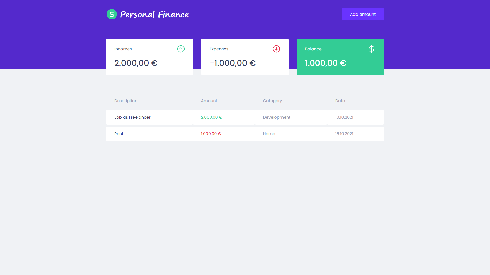
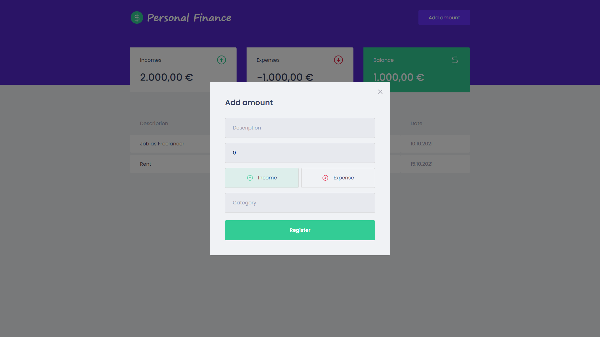

# Personal Finance App

A personal finance application for daily control of incomes and expenses.

## Table of Contents

- [Technologies and tools](https://github.com/marcelosperalta/app_front-end_personal_finance#technologies-and-tools)
- [Screenshots](https://github.com/marcelosperalta/app_front-end_personal_finance#screenshots)
- [Run the project](https://github.com/marcelosperalta/app_front-end_personal_finance#run-the-project)

## Technologies and tools

- HTML
- CSS
    - [styled-component](https://styled-components.com/)
    - [polished](https://polished.js.org/)
- JavaScript
- [TypeScript](https://www.typescriptlang.org/)
- [React](https://reactjs.org/)
    - [Create React App](https://create-react-app.dev/)
    - [react-modal](http://reactcommunity.org/react-modal/)
- [Mirage JS](https://miragejs.com/)
- [Axios](https://axios-http.com/)

## Screenshots





## Run the project

```
yarn install
```

```
yarn start
```